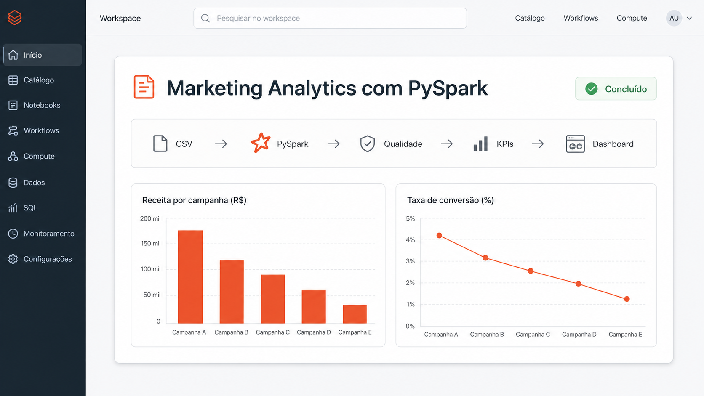

# Marketing Analytics com PySpark



Projeto de portfólio que simula o pipeline analítico de uma empresa de marketing digital. A solução transforma dados de clientes, campanhas, interações e vendas em indicadores acionáveis, arquivos analíticos, gráficos e um dashboard HTML.

## Problema de negócio

A equipe de marketing precisa avaliar quais campanhas geram receita e engajamento, entender o perfil geográfico e setorial do faturamento e identificar oportunidades de conversão. O pipeline consolida essas perguntas em uma execução reproduzível.

## Como o problema chegou até mim

Este é um case de portfólio com dados simulados. Eu parti de uma queixa que poderia surgir em uma conversa simples com a liderança: **“Estamos enviando muitos e-mails, mas não conseguimos entender se eles realmente estão trazendo resultado.”**

Antes de falar em ferramenta, eu traduzi a preocupação para perguntas objetivas:

- os clientes estão recebendo, abrindo e clicando nas campanhas?
- quais campanhas terminam em compra e receita?
- estamos olhando para clientes únicos ou contando a mesma pessoa várias vezes?
- os números são confiáveis o suficiente para orientar uma decisão?

Minha primeira resposta para a liderança seria direta: **“Vou organizar a jornada completa, validar a qualidade dos dados e separar engajamento de resultado financeiro. Depois eu volto com o que está acontecendo e com as prioridades.”**

## O que identifiquei na análise

A reclamação inicial falava de e-mails, mas o problema principal não era apenas o envio. Os dados estavam separados entre clientes, campanhas, interações e vendas. Sem integrar essas fontes, uma abertura podia parecer um bom resultado mesmo quando não havia clique, compra ou receita.

Também identifiquei pontos que poderiam distorcer a leitura:

- valores ausentes, chaves inválidas e registros duplicados;
- cliques que precisavam respeitar a regra de abertura anterior;
- campanhas com abertura, mas sem conversão ou faturamento;
- risco de inflar taxas ao contar eventos em vez de clientes únicos;
- falta de uma visão única para comparar campanha, canal, cidade, segmento e período.

Com isso, eu explicaria para a liderança: **“O e-mail é a parte mais visível da reclamação, mas a causa real é que ainda não conseguimos acompanhar o caminho entre o contato e a venda com uma regra única. Primeiro precisamos confiar no número; depois podemos otimizar a campanha.”**

## Como priorizei a solução

Eu foquei primeiro no problema central: construir uma base confiável que conectasse campanha, interação e venda. Para isso, defini schemas, tratei nulos e duplicidades, normalizei as regras de abertura e clique e consolidei cada cliente por campanha. Só então calculei abertura, clique, conversão, receita e ticket médio.

Depois de resolver essa base, avancei nas outras pontas que continuavam abertas:

1. comparei o desempenho e a receita das campanhas;
2. analisei cidade, segmento e evolução mensal;
3. identifiquei clientes que abriram campanhas, mas nunca compraram;
4. exportei os resultados em CSV e Parquet;
5. criei gráficos, dashboard e testes automatizados para tornar a análise reproduzível.

O resultado não é apenas um dashboard. É um fluxo em que a liderança consegue perguntar **“onde está o problema?”** e receber uma resposta simples, rastreável e apoiada por regras claras. Minha forma de comunicar seria: **“Hoje já conseguimos distinguir interesse de resultado, enxergar onde a jornada quebra e escolher a próxima ação com mais segurança.”**

## Arquitetura da solução


`CSV → ingestão com schema → qualidade → transformação → indicadores → CSV/Parquet → gráficos/dashboard`

- **Ingestão:** leitura dos arquivos com schemas explícitos.
- **Qualidade:** chaves válidas, padronização, nulos e duplicidades.
- **Transformação:** consolidação da jornada e enriquecimento das vendas.
- **Análise:** métricas de receita, engajamento, conversão e clientes.
- **Consumo:** CSV, Parquet, PNG e dashboard Plotly autocontido.

## Tecnologias

- Python 3.12
- Apache Spark / PySpark 4.1
- Matplotlib
- Plotly
- Parquet e CSV

## Estrutura

```text
marketing-pyspark/
├── data/                   # fontes CSV fictícias
├── notebooks/              # espaço para análises exploratórias
├── output/                 # resultados gerados
│   ├── csv/
│   ├── parquet/
│   ├── graficos/
│   ├── arquitetura.svg
│   └── dashboard.html
├── scripts/
│   ├── ingestao.py
│   ├── limpeza.py
│   ├── transformacao.py
│   ├── analise.py
│   ├── exportacao.py
│   ├── visualizacao.py
│   └── gerar_dados.py
├── main.py
├── requirements.txt
└── README.md
```

## Instalação

Pré-requisitos: Python 3.12 e Java 17 ou superior disponíveis no `PATH`.

```bash
python -m venv .venv
# Windows
.venv\Scripts\activate
pip install -r requirements.txt
```

## Execução

```bash
python main.py
```

Na primeira execução, os quatro CSVs são criados de forma determinística em `data/`, com 3.000 a 9.000 registros por arquivo. Para recriá-los:

```bash
python -m scripts.gerar_dados
```

Após a execução, abra `output/dashboard.html` diretamente no navegador. Os resultados tabulares ficam em `output/csv/` e `output/parquet/`.

## Testes

Instale as dependências de desenvolvimento e execute a suíte:

```bash
pip install -r requirements-dev.txt
python -m pytest -q
```

Os testes validam as principais regras de qualidade, a consolidação da jornada do cliente e os cálculos de receita, engajamento e conversão.

## Indicadores

- receita, abertura, clique, conversão e ticket médio por campanha;
- receita por cidade e segmento;
- ranking de campanhas e top 10 clientes;
- clientes que abriram campanhas, mas nunca compraram;
- evolução mensal de vendas.

As taxas usam clientes únicos impactados como denominador. A conversão considera clientes compradores únicos associados à campanha.

## Melhorias futuras

- processamento incremental e particionamento por período;
- catálogo de dados, observabilidade e alertas;
- orquestração com Airflow e armazenamento em nuvem;
- dashboard conectado a uma camada semântica atualizada.
